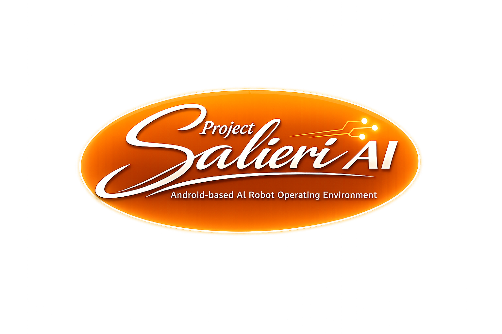
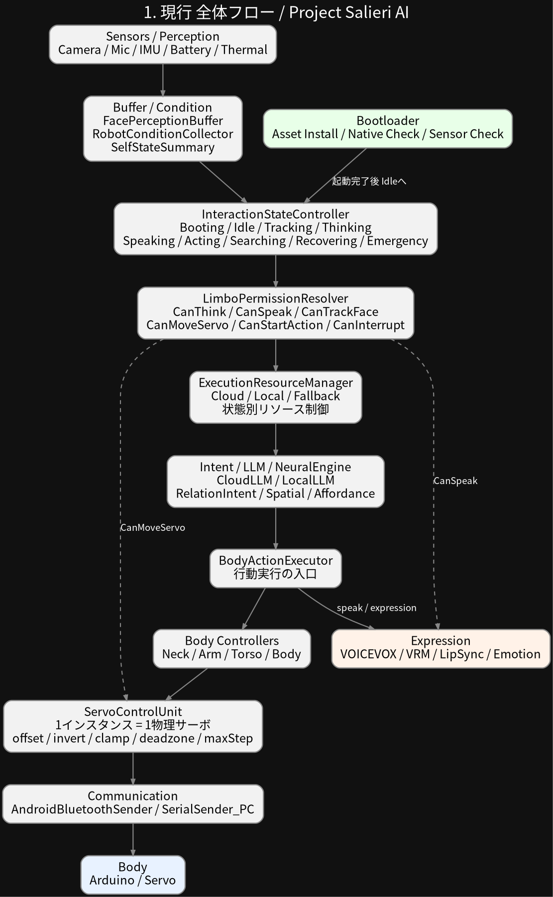
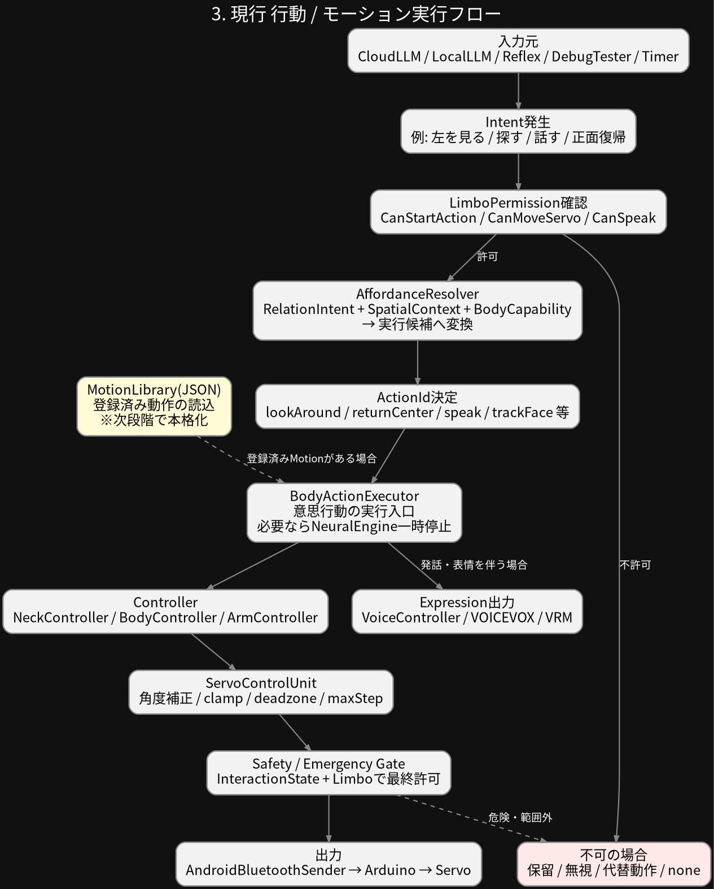
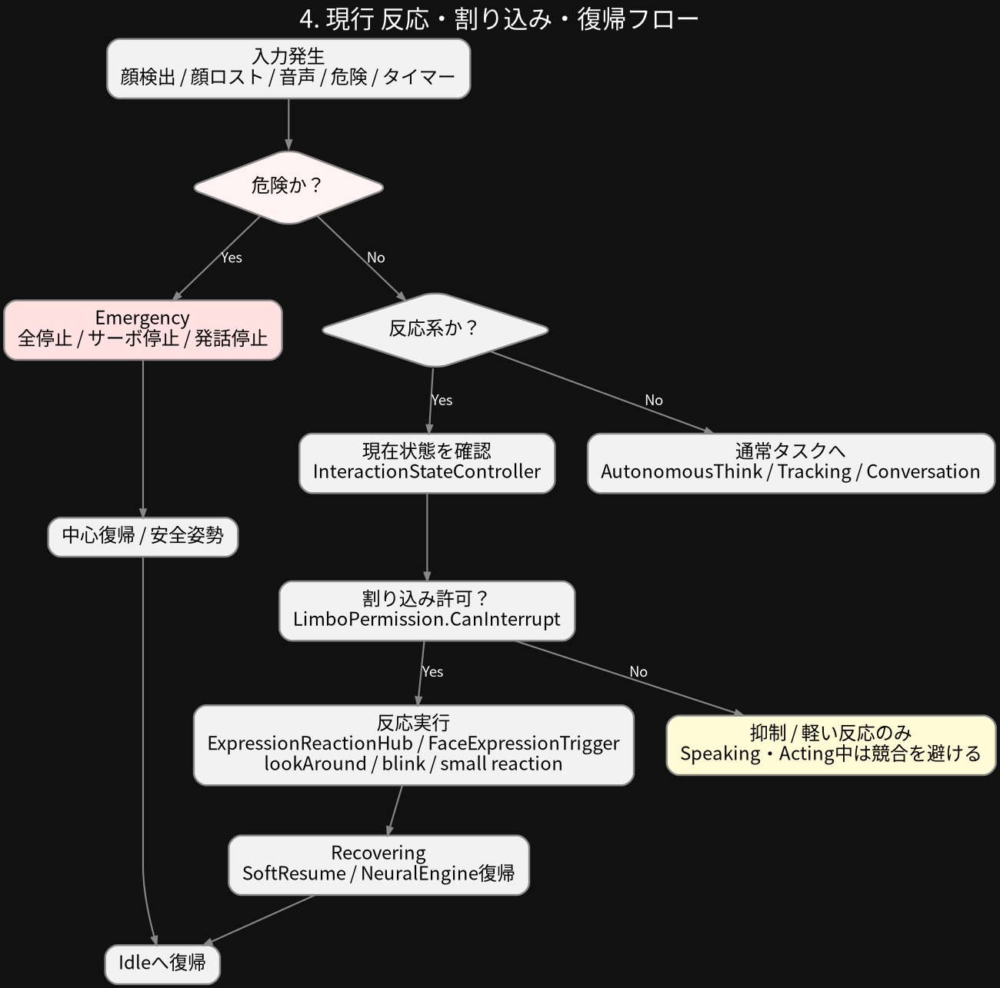
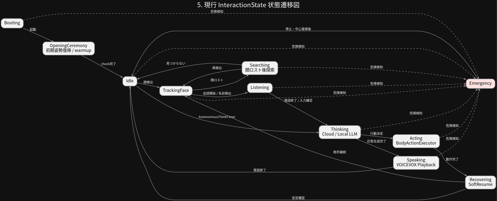
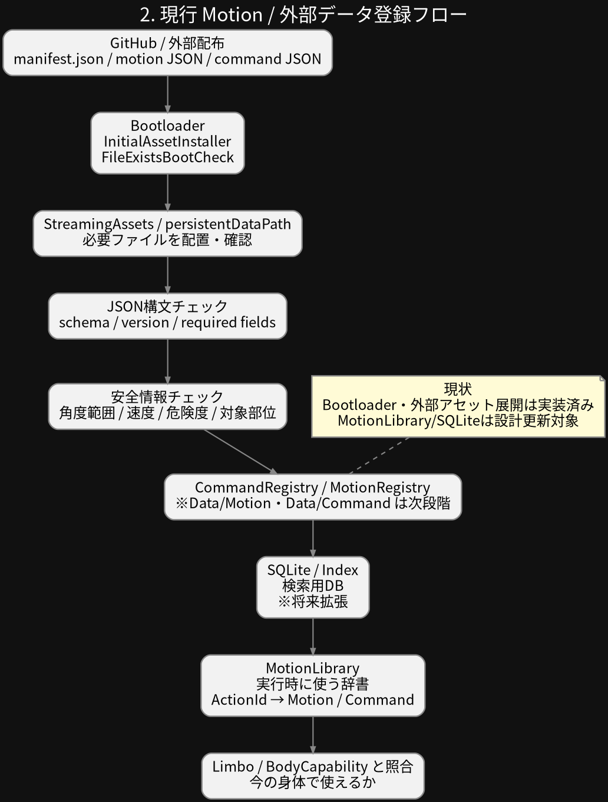
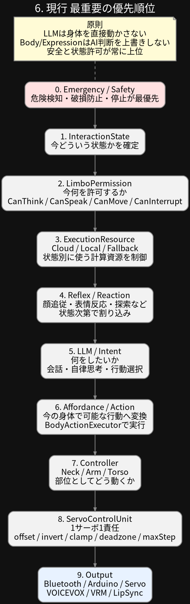

# Project Salieri AI
<p align="center">
  
</p>
Android-based AI Agent Runtime Architecture

---

# 日本語

## 概要

Project Salieri AI は、Android端末を中核Runtimeとして利用し、

- センサー入力
- 状態管理
- AI意思決定
- 音声出力
- 外部機器制御

を統合する、AndroidベースのAIエージェント実行基盤です。

本プロジェクトは、単なるAIチャットアプリではなく、

- 状態
- 意思
- 許可
- 行動
- 物理制御

を分離しながら、現実世界と接続可能なAI Runtime構造を目指しています。

---

## 公開方針

このリポジトリは、**Unityプロジェクトをそのまま開いて動作させるための完全パッケージではありません。**

公開目的は、以下の共有です。

- Project Salieri AI のRuntime構造
- AI / State / Limbo / Body / Servo の責任分離
- Androidを中核Runtimeとして使う設計思想
- Unity C# / Android Kotlin の公開可能なソース
- AIエージェントを実世界へ接続するための構造例

そのため、Unity固有の `.meta` ファイル、Editor設定、外部依存アセット、Native Runtimeバイナリ、大型モデルファイル等は意図的に除外しています。

このリポジトリは、**Source and Architecture Reference** として公開しています。

---

## 現在の公開範囲

このリポジトリには、現在以下が含まれています。

- Runtime Architecture
- State / Limbo 構造
- Autonomous Runtime
- Body / Servo 分離構造
- Android Runtime構成
- Cloud / Local LLM分離
- Voice / Expression構造
- Bootloader構造
- Unity C# ソース
- Android Kotlin ブリッジ
- 構成図

一部のRuntime・外部依存・大型アセットは含まれていません。

---

## 現在の構成

基本構造：

```text
Sensor / External Input
↓
State Snapshot
↓
InteractionState
↓
Limbo Permission
↓
Execution Resource
↓
Intent / LLM / Affordance
↓
BodyActionExecutor
↓
Controller
↓
ServoControlUnit
↓
Communication
↓
External Device
```

---

## アーキテクチャ図

現在、このリポジトリには以下の構成図が含まれています。

### Current Runtime Architecture

#### Overall Runtime Flow



#### Action Execution Flow



#### Interrupt / Recovery Flow



#### Interaction State Transition



---

### Planned Runtime Extensions

#### Motion Registry Structure



#### Runtime Priority Structure



※ 一部の図には、現在未実装の将来構想が含まれています。

---

## 実装済み要素

現在、開発環境ではAndroid実機上で以下の同時稼働を確認しています。

- Cloud LLM
- Local LLM (llama.cpp / GGUF)
- OpenCV Face Tracking
- VOICEVOX Runtime
- Bluetooth Communication
- Servo Control
- Autonomous Runtime
- InteractionState
- Limbo Permission

ただし、この公開リポジトリには、動作に必要な外部Runtimeや大型アセットの一部は含まれていません。

---

## 設計思想

Project Salieri AI では、以下の分離を重視しています。

- AIが直接ハードウェアを制御しない
- 状態と許可を分離する
- Reflex / Intention / Safety を分離する
- 物理制御はController層以下へ限定する
- Communication層には通信以外の判断を持たせない

主な責任分離：

```text
LLM
↓
Intent
↓
Controller
↓
ServoControlUnit
↓
Communication
```

LLMは「何をしたいか」までを扱い、サーボID・通信・物理補正・安全制限には直接関与しません。

---

## 含まれていないもの

ライセンス・配布・容量・個別環境依存の都合により、以下は含まれていません。

- Unity `.meta` files
- Unity Editor settings
- GGUF Models
- VOICEVOX Runtime binaries
- VOICEVOX voice models
- OpenCV for Unity assets
- Native Runtime binaries (`.so`)
- VRM Models
- 大型外部アセット
- 個人環境固有の設定ファイル

必要な場合は、各公式配布元から取得してください。

---

## 注意

このリポジトリは、ソースと設計構造の公開を目的としています。

そのため、

- clone直後にUnityで完全動作すること
- すべてのScene参照が復元されること
- 外部Runtimeが同梱されていること
- モデルファイルが同梱されていること

は保証していません。

実際に動作させるには、外部依存の導入、Unity側の参照設定、Android権限設定、Native Runtime配置、モデル配置などが別途必要です。

---

## 外部依存

本プロジェクトは以下のOSS・外部技術を利用しています。

- Unity
- Android SDK / NDK
- llama.cpp
- VOICEVOX
- OpenCV / OpenCV for Unity
- UniVRM
- Arduino / Bluetooth SPP

詳細は各ライセンスを参照してください。

---

## ライセンス

Project Salieri AI is licensed under the Apache License 2.0.

詳細は `LICENSE` を参照してください。

外部ライブラリ、モデル、Runtime、アセットについては、それぞれの配布元のライセンスに従ってください。

---

# English

## Overview

Project Salieri AI is an Android-based AI Agent Runtime Architecture.

The project integrates:

- sensor input
- state management
- AI decision layers
- voice output
- external device control

into a unified runtime structure.

This project focuses on separating:

- State
- Intention
- Permission
- Action
- Physical Control

for safe real-world AI integration.

---

## Publication Policy

This repository is **not a complete plug-and-play Unity project package**.

It is published as a:

**Source and Architecture Reference**

The purpose of this repository is to share:

- the runtime architecture of Project Salieri AI
- separation of AI / State / Limbo / Body / Servo responsibilities
- the design concept of using Android as the core AI runtime
- public Unity C# / Android Kotlin source code
- an example structure for connecting AI agents to the real world

Unity `.meta` files, editor settings, external assets, native runtime binaries, and large model files are intentionally excluded.

---

## Public Scope

This repository currently includes:

- Runtime architecture
- State / Limbo systems
- Autonomous runtime structure
- Body / Servo separation design
- Android runtime integration
- Cloud / Local LLM routing
- Voice / Expression systems
- Bootloader systems
- Unity C# sources
- Android Kotlin bridge code
- Architecture diagrams

Some runtime components and large external assets are NOT included.

---

## Current Architecture

Basic structure:

```text
Sensor / External Input
↓
State Snapshot
↓
InteractionState
↓
Limbo Permission
↓
Execution Resource
↓
Intent / LLM / Affordance
↓
BodyActionExecutor
↓
Controller
↓
ServoControlUnit
↓
Communication
↓
External Device
```

---

## Architecture Diagrams

This repository includes the following diagrams.

### Current Runtime Architecture

#### Overall Runtime Flow


#### Action Execution Flow


#### Interrupt / Recovery Flow


#### Interaction State Transition


---

### Planned Runtime Extensions

#### Motion Registry Structure


#### Runtime Priority Structure


Some diagrams include planned future extensions that are not yet fully implemented.

---

## Implemented Components

In the development environment, the following components have been verified on Android hardware:

- Cloud LLM
- Local LLM (llama.cpp / GGUF)
- OpenCV face tracking
- VOICEVOX runtime
- Bluetooth communication
- Servo control
- Autonomous runtime
- InteractionState
- Limbo Permission

However, this public repository does not include some external runtimes or large assets required for full execution.

---

## Design Philosophy

Project Salieri AI separates:

- AI decision layers
- permissions
- reflex systems
- physical control
- communication

The AI does NOT directly control hardware.

Main responsibility flow:

```text
LLM
↓
Intent
↓
Controller
↓
ServoControlUnit
↓
Communication
```

The LLM handles intention-level decisions only.  
It does not directly handle servo IDs, communication, physical correction, or safety limits.

---

## Not Included

Due to licensing, distribution size, and environment-specific constraints, this repository does NOT include:

- Unity `.meta` files
- Unity editor settings
- GGUF models
- VOICEVOX runtime binaries
- VOICEVOX voice models
- OpenCV for Unity assets
- native runtime binaries (`.so`)
- VRM models
- large external assets
- personal environment-specific settings

Please obtain required dependencies separately from their official sources.

---

## Important Note

This repository is intended to publish source code and architecture structure.

Therefore, it does not guarantee that:

- the project will run immediately after cloning
- all Unity scene references are restored
- external runtimes are included
- model files are included

To run the system, additional setup is required, including external dependencies, Unity reference settings, Android permissions, native runtime placement, and model installation.

---

## External Dependencies

This project uses:

- Unity
- Android SDK / NDK
- llama.cpp
- VOICEVOX
- OpenCV / OpenCV for Unity
- UniVRM
- Arduino / Bluetooth SPP

Please refer to each project license.

---

## License

Project Salieri AI is licensed under the Apache License 2.0.

See `LICENSE` for details.

External libraries, models, runtimes, and assets are governed by their own licenses.
